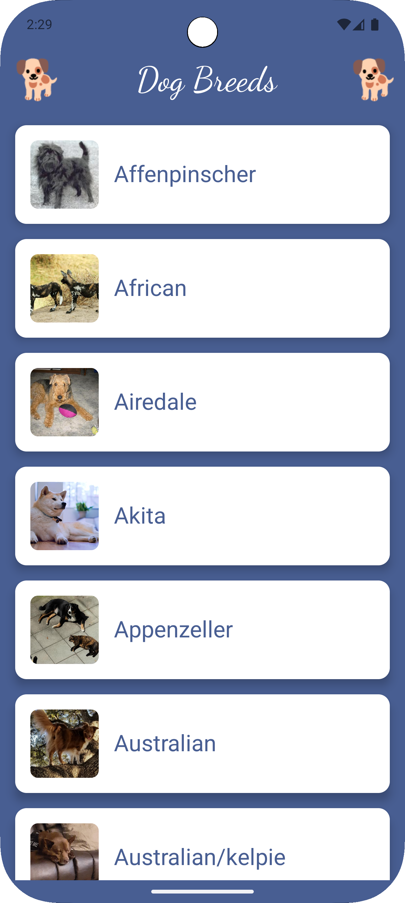
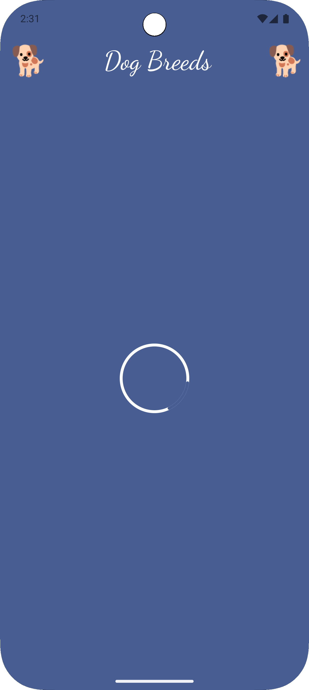
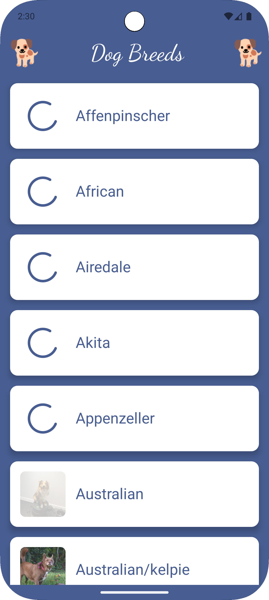
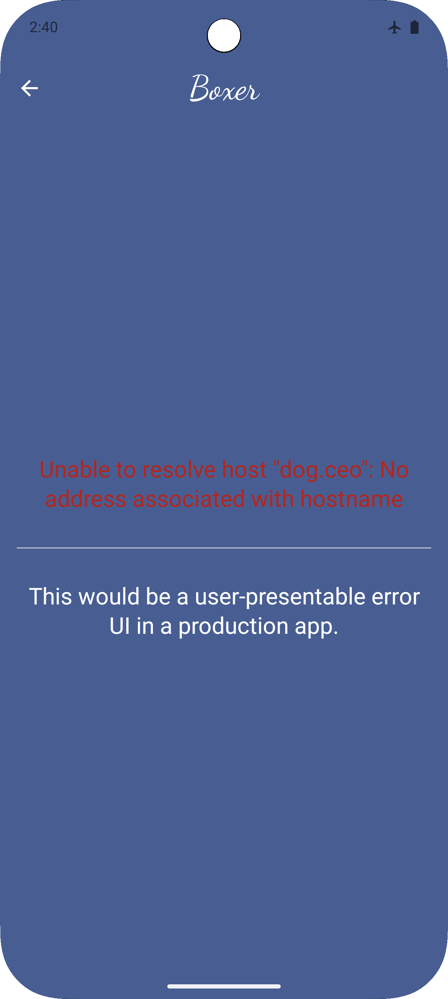
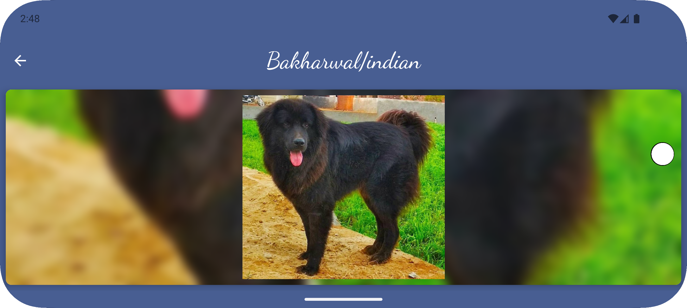
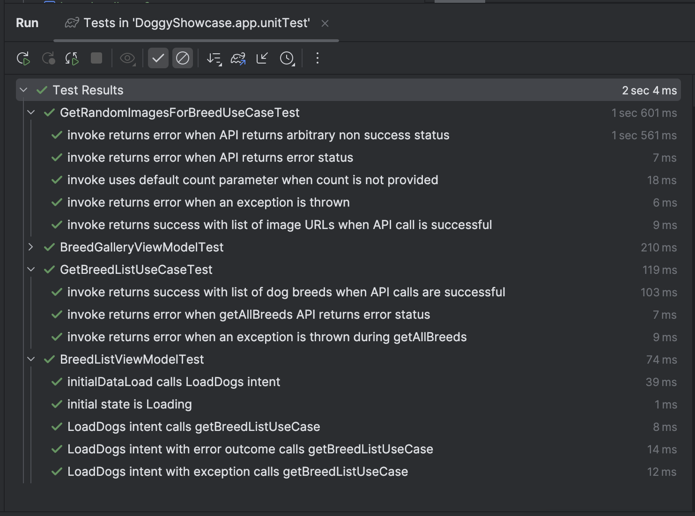
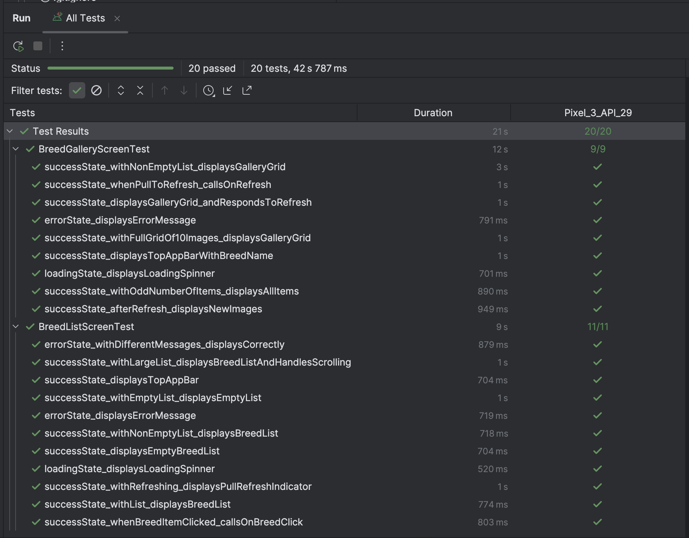

# DoggyShowcase

## Project Overview

Doggy Showcase is an Android application that displays a list of dog breeds and allows users to select a breed and view
a gallery of 10 random images, subject to availability.
The app demonstrates modern Android development practices, including Clean Architecture, MVI pattern, and Jetpack
Compose for UI.

## Features

- Display a list of dog breeds
- View a gallery of 10 images for a selected breed
- Error handling and loading states
- Navigation between screens

## Extras

- Pull-to-refresh functionality to get new random images or to refresh if any api error occurs
- Some nice UI design to enhance the user experience
- Display a list of dog breeds with a random image of the breed (on main list screen in addition to the gallery)
- A nice UI Gallery grid design that works well for any number of images, even or odd, and handles configuration
  orientation changes gracefully
- To support orientation changes and still keep a nice UI, I opted to detect the current orientation and adjust the
  number of columns and rows of the GalleryGrid accordingly.

## Technologies Used

### Architecture

- **Clean Architecture**: Separation of concerns with data, domain, and presentation layers
- **MVI (Model-View-Intent)**: Unidirectional data flow for predictable state management
- **Package-by-Feature**: Organized by feature with shared domain and data layers

### Libraries & Frameworks

- **Jetpack Compose** For declarative modern UI
- **Koin**: Dependency injection for better testability and maintainability
- **Kotlin Flow**: For reactive state management
- **Retrofit**: Type-safe HTTP client for API communication
- **Gson**: JSON parsing libraries
- **Coil**: Image loading library with caching capabilities
- **Navigation Compose**: For screen navigation

### ViewModels

- Base MVIViewModel for consistent abstracted state management across features to reduce boilerplate and remove
  duplicate code
- Feature-specific ViewModels that handle business logic and state updates
- Initial data loading using onStart and stateIn to ensure data is loaded efficiently and only once in line with the
  ViewModel lifecycle. For e.g. the data is not reloaded on configuration changes and overriding initialDataLoad is
  optional.

### Image Loading

- Coil for efficient image loading with memory and disk caching
- Optimized image loading for list items and gallery items in a shared component

### Performance

- Concurrent image loading of random images for dog breed list
- Background processing for network operations
- Optimised image loading and caching

# Testing

### Unit Tests

- Focusing on testing individual components such as use-cases and ViewModels in isolation.

### UI Tests

- Focusing on testing UI components with predefined states.

# Assumptions

(In a real project, these would be highlighted and negotiated with the team/product owner as assumptions at the define
phase and adjusted for any variation in the intended implementation)

* There will always at least one dog breed returned in a successful api call to get the dog breeds.
* There will always be at least one image returned in a successful api call to get the images for a dog breed.
* There is no need to handle Empty list or gallery UI states.
* Breed data from the API is hierarchical but was flattened to consume all breeds and sub-breeds.

## Trade-offs

- Repositories were not used for this small project as consuming the API directly from the use cases was sufficient.
  Adding another layer here would have added extra complexity that would have been superfluous. In a larger production
  app with multiple, local, and remote data sources, this decision would have been reconsidered.
- Navigation was kept simple intentionally by passing through the unique dog breed name as this was enough for
  demonstrating compose navigation fundamentals. In a larger app with local persisted data, best practice here would be
  passing unique identifiers through nav params and loading any larger, more complex data as required.
- Testing was covered with several basic unit, integration, and instrumented UI test cases in a few core areas to
  demonstrate capability. In production, the dev team would adhere to an agreed coverage target.
- Modularisation was not implemented as it would be overengineering for a small app.
- No offline data persistence was implemented, so no local storage caching capabilities; all data is loaded from the
  network every time.
- Pagination wasn't implemented as it wasn't available from the API.

# Screenshots

<table>
  <tr>
    <td></td>
    <td></td>
    <td></td>
    <td></td>
  </tr>
  <tr>
    <td></td>
    <td></td>
    <td></td>
    <td></td>
  </tr>
</table>

<table>
  <tr>
    <td></td>
  </tr>
  <tr>
    <td></td>
  </tr>
  <tr>
    <td></td>
  </tr>
</table>

<table>
  <tr>
    <td></td>
  </tr>
  <tr>
    <td></td>
  </tr>
</table>
